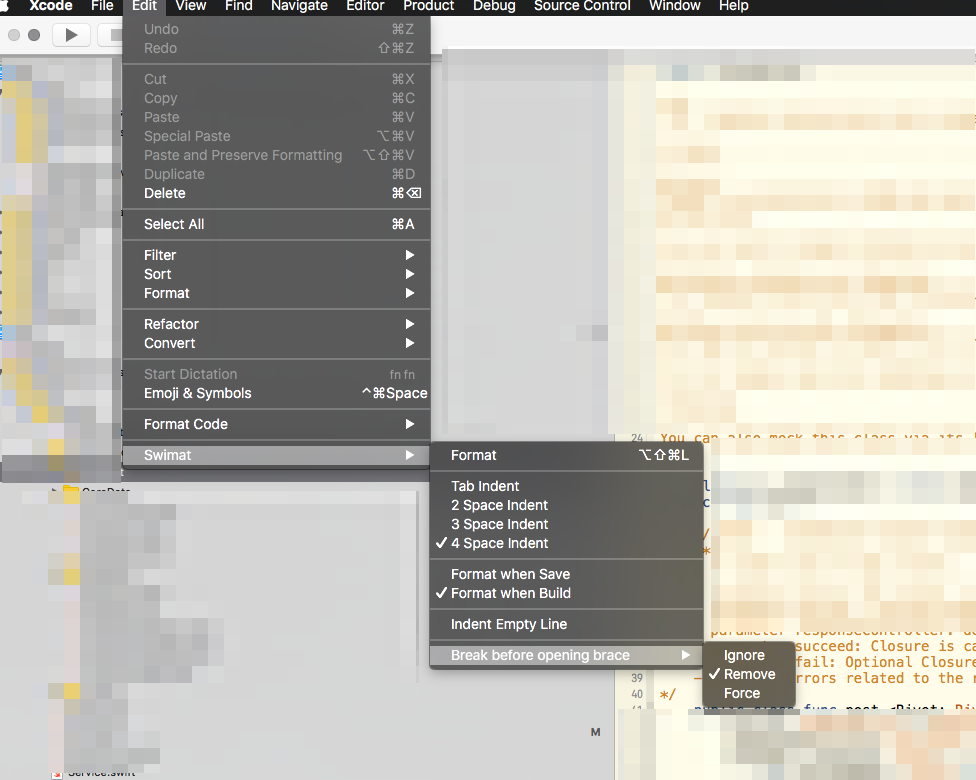

Faro
[](https://travis-ci.org/icapps/ios-faro) [](http://cocoapods.org/pods/Faro) [](http://cocoapods.org/pods/Faro) [](http://cocoapods.org/pods/Faro)
======

For a quick start follow the instructions below. For more in depth information on why and how we build Faro, the [wiki](https://github.com/icapps/ios-faro/wiki) page.

## Concept
We build a service request by using a `Bar` class as the point where you fire your `Order` and get a `Result`.

## Get Served

Take a look at the `BarSpec`, in short:

```swift

```

## Write unit tests
In the example project you can find examples written with `Nimbel` for both CoreData and others.

## Requirements

- iOS 8 or higher
- Because we use generics you can only use this pod in Swift only files. You can mix and Match with Objective-C but not with generic classes.  Types [More info](https://developer.apple.com/library/ios/documentation/Swift/Conceptual/BuildingCocoaApps/InteractingWithObjective-CAPIs.html#//apple_ref/doc/uid/TP40014216-CH4-ID53)

## Installation

Faro is available through [CocoaPods](http://cocoapods.org) and the [Swift Package Manager](https://swift.org/package-manager/).

To install it with CocoaPods, add the following line to your Podfile:

```ruby
pod "Faro"
```

## Contribution

> Don't think too hard, try hard!

More info on the [contribution guidelines](https://github.com/icapps/ios-faro/wiki/Contribution) wiki page.

### Coding Guidelines

We follow the [iCapps Coding guidelines](https://github.com/icapps/coding-guidelines/tree/master/iOS/Swift). To make it easy for you you can use [Swimat](https://github.com/Jintin/Swimat) and put the settings like the screenshot below:

!

Your code is checked on style with [Tailor](https://github.com/sleekbyte/tailor)

## License

Faro is available under the MIT license. See the LICENSE file for more info.
