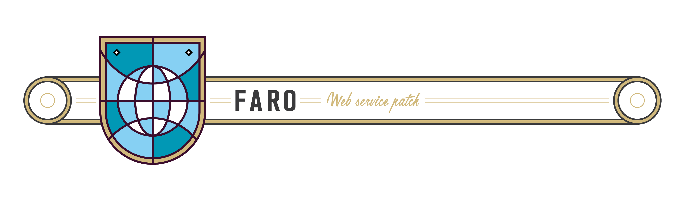

[](https://swift.org)

---

A common place for our Networking code. On iOS this can be tricky. Since Swift 4.0 this can be very straight forward with the `Codable` protocol. More info on [WWWDC 2017 session video: New in Founcation](https://developer.apple.com/videos/play/wwdc2017/212/)

Our goal with Faro is:

* Decode objects from JSON data returned from any service.
* Easy to debug errors and logs in the console
* Simplify security setup

Go play in the *FaroPlayground*.

## Get started

Open the `./Example/Faro.xcworkspace` and open the FaroPlayground. You will be guided into the concepts as you try out the code.

As always feedback more then welcome. (🍻 also!)

### Asynchronous Throwing
Faro makes heavy use of Asynchronous Throwing. Why this is can be found a a super post from 2015 from @terhechte https://appventure.me/2015/06/19/swift-try-catch-asynchronous-closures/


## Requirements

- iOS 10 and Swift 4.0 or higher
- Because we use generics you can only use this pod in Swift only files. You can mix and Match with Objective-C but not with generic classes.  Types [More info](https://developer.apple.com/library/ios/documentation/Swift/Conceptual/BuildingCocoaApps/InteractingWithObjective-CAPIs.html#//apple_ref/doc/uid/TP40014216-CH4-ID53)

## Installation

Faro is available through [CocoaPods](http://cocoapods.org) and the [Swift Package Manager](https://swift.org/package-manager/).

To install it with CocoaPods, add the following line to your Podfile:

```ruby
pod "Faro" "~>3.0"
```

## Contribution

More info on the [contribution guidelines](https://github.com/icapps/ios-faro/wiki/Contribution) wiki page.

### Coding Guidelines

We follow the [iCapps Coding guidelines](https://github.com/icapps/coding-guidelines/tree/master/iOS/Swift).

We use Swiftlint to keep everything neat.

## License

Faro is available under the MIT license. See the LICENSE file for more info.
